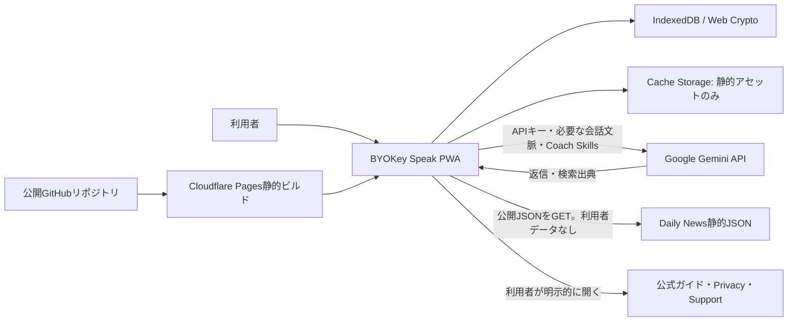

# BYOKey Speak PWA 実装設計指示書

- 文書状態: 実装着手可能
- 作成日・一次情報確認日: 2026-08-11
- 実装対象リポジトリ: `https://github.com/shunya-0310/byokey-speak-pwa.git`
- 現行参照実装: `D:\ドキュメント\Codex\byokey-speak-android`
- 想定実装担当: GPT-5.5

## 0. この指示書の結論

BYOKey Speakは、Gemini専用の登録不要PWAとして再構築する。

採用する構成は次のとおりである。

1. React、TypeScript、Viteによる静的SPA/PWAとする。
2. Gemini Generate Content APIへブラウザから直接HTTPSリクエストを送る。
3. APIキー、会話、Vocabulary List、進捗、会話分析、設定は利用者のブラウザ内へ保存する。
4. BYOKey Labのアプリケーションサーバー、ユーザー登録、SupabaseはMVPでは使用しない。
5. ソースコードは指定のGitHubリポジトリで公開する。
6. 公開GitHubリポジトリからCloudflare Pagesへ静的ファイルだけを自動デプロイする。
7. Pages Functions、Workers、D1、KV、R2、Supabase、独自API、アクセス解析、クラッシュ解析は追加しない。
8. 初回案内、APIキー入力画面、Helpで、クライアント側APIキー利用のリスクを明示する。
9. 同一端末での通常利用ではAPIキーを再入力させない。機種変更、別ブラウザ、サイトデータ削除後は再入力を求める。
10. 学習データ消失対策として、IndexedDB、永続ストレージ要求、暗号化バックアップ、復元前検証、バックアップ案内を実装する。

ユーザー登録もSupabaseも、現在の要件を満たすためには不要である。実装担当は独断で導入してはならない。

## 1. 契約と完成条件

### 1.1 目的

現行Android版の世界観と中心体験を維持しつつ、Geminiだけを利用する公開可能なPWAへ移行する。

利用者は自分のGemini APIキーを使う。BYOKey LabはAPIキー、会話本文、学習データを受け取らない。

### 1.2 完成条件

次のすべてを満たした時点で実装完了とする。

- 5ページの初回案内がある。
- Chats、Review、Progress、Settingsの4タブがある。
- 自由会話、Topics、Daily Newsから同じ会話画面を開始できる。
- 日本語、英語、混在文を送信できる。
- Quick Assist、Undo、翻訳、読み上げ、音声入力、Web検索指定が機能する。
- 複数チャットの作成、復帰、名前変更、ピン留め、削除が機能する。
- Vocabulary List、学習メモ、進捗、会話分析が端末内へ保存される。
- CEFR A1からC2、Coach Skills、テーマ、音声、効果音設定が保存される。
- Gemini APIキーが同一オリジンのブラウザ内だけに保存される。
- APIキーはURL、ログ、Service Workerキャッシュ、バックアップ、共有画像へ入らない。
- 学習データの暗号化エクスポートと復元が動作する。
- インストール可能で、アプリシェルと保存済みデータはオフラインで閲覧できる。
- Gemini通信、Daily News取得、外部リンク以外の外部通信が発生しない。
- 公開サイトのAbout画面から、実行中コミットと公開GitHubソースへ到達できる。
- CI、単体テスト、E2E、ブラウザ実機確認が通る。

## 2. 重要な事実と設計上の判断

### 2.1 ブラウザから通信できることと、APIキー利用が推奨されることは別である

Gemini APIはAPIキー認証とRESTの`generateContent`を提供している。一方、Google公式は本番のWebまたはモバイルクライアントへAPIキーを露出しないよう案内し、通常はバックエンドプロキシを推奨している。

したがって、公開文言に次の表現を使ってはならない。

- 「GoogleがブラウザでのAPIキー利用を公式に推奨している」
- 「Geminiならクライアント側にキーを置いても安全」
- 「暗号化しているためAPIキーは絶対に取り出せない」
- 「Googleのガイドライン上、問題がないことが保証されている」

本製品の正確な位置づけは次のとおりである。

> BYOKey Speakは、利用者自身が用意したGemini APIキーを、利用者のブラウザからGemini APIへ直接送信するBYOK型PWAです。BYOKey Labは、APIキーを受信、保存、閲覧するためのアプリケーションサーバーやデータベースを持たず、通常利用時に利用者のAPIキーを保存・把握しません。ソースコードはGitHub（https://github.com/shunya-0310/byokey-speak-pwa）でオープンソースとして公開し、データの保存先、通信先、APIキーの取扱いを第三者が確認できるようにします。公開サイトのAboutには実行中のバージョンとGit commit SHAを表示し、公開コードとの対応を追跡できるようにします。ただし、クライアント側でAPIキーを扱う構成は、Google公式の一般的なセキュリティ推奨とは異なります。オープンソースであること自体がAPIキーを保護するものではありません。利用者がこのリスクを理解し、専用キー、利用制限、利用量確認、キーのローテーションを行うことへ同意した場合だけ利用できます。

参考:

- [Google: Using Gemini API keys](https://ai.google.dev/gemini-api/docs/api-key)
- [Google: Generate Content API](https://ai.google.dev/api/generate-content)

### 2.2 公開判断

BYOKey Labとしては、次の条件を守る場合に限り公開対象とする。

- 対応プロバイダーはGeminiのみ。
- 利用者本人のキーだけを使う。
- キーをソースコードやビルドへ埋め込まない。
- キーをBYOKey Labへ送らない。
- リスク説明と明示同意を送信前に行う。
- 実装とデータフローをGitHubで公開する。
- リリース直前に、公開オリジンからGemini APIへの実ブラウザ接続を再検証する。

技術的に接続できることは、将来のGoogle仕様、規約、漏えい検知によるブロックが変わらないことを保証しない。公開前と主要リリース前に公式文書を再確認する。

### 2.3 ユーザー登録と課金

ユーザー登録は行わない。

登録なし、独自バックエンドなし、ソース公開という条件では、ホストされたPWAへの厳密な買い切りアクセス制御は実装できない。MVPでは次の料金説明に統一する。

> BYOKey Speak自体に月額利用料はありません。Gemini APIの利用料は、利用者自身のGoogleアカウントへ利用量に応じて請求されます。無料枠、料金、学習利用の条件はGoogleの最新情報をご確認ください。

将来、PWA本体を有料化する場合は、ライセンス認証やアカウントが必要になる。これはMVPの範囲外であり、別の事業判断を行う。

### 2.4 PWAで完全再現できない機能

次の2点は、Androidネイティブ版と同等保証できない。

1. 毎朝6時30分頃のバックグラウンド通知。
2. すべてのブラウザでの音声認識と読み上げ後の自動マイク開始。

Periodic Background Syncはブラウザ互換性が限定され、実行時刻もOSとブラウザに委ねられる。サーバーPushを使えば改善できるが、Push subscriptionを運営側で保持する必要が生じるためMVPでは採用しない。

参考:

- [MDN: Web Periodic Background Synchronization API](https://developer.mozilla.org/en-US/docs/Web/API/Web_Periodic_Background_Synchronization_API)
- [MDN: SpeechRecognition](https://developer.mozilla.org/en-US/docs/Web/API/SpeechRecognition)

### 2.5 現行機能との対応表

| 現行Android版 | PWAでの扱い |
| --- | --- |
| 5ページOnboarding | 文言をGemini専用・PWA用へ変更して維持 |
| Chats / Review / Progress / Settings | 4タブを維持 |
| 複数チャット、名前変更、ピン留め、削除 | IndexedDBで維持 |
| 自由会話、Topics、Daily News | 統一会話画面で維持 |
| 日本語、英語、混在文 | 維持 |
| Quick Assist、候補1〜3件、追記、Undo | 維持 |
| Coach返信の翻訳、読み上げ | Web APIで維持。ブラウザ差を許容 |
| 音声入力 | 対応ブラウザで維持。非対応時はOSキーボード音声入力へ案内 |
| Off / 手動送信 / Full Auto | feature detect付きで維持。自動マイク不可時は1タップへfallback |
| Web検索の明示指定と出典 | Gemini Google Searchで維持 |
| CEFR A1〜C2 | 維持 |
| Coach Personalities & Skills | Markdown対応のCoach Skillsとして維持 |
| Vocabulary List、手動追加、意味編集、お気に入り | 維持 |
| streak、日数、ターン、Assist、復習統計 | ローカル集計で維持 |
| Your English Profileと分析履歴 | 利用者操作時だけGeminiへ送り維持 |
| Dark / Light、効果音 | 維持 |
| 文脈チュートリアル | DOM anchor方式で維持 |
| Gemini / OpenAI / Claude | Geminiだけに変更 |
| Android Keystore | Web Crypto + IndexedDBへ置換。強度差を説明 |
| Room | Dexie + IndexedDBへ置換 |
| Android暗号化backup | formatVersion 1互換を維持 |
| 毎朝6:30頃のOS通知 | 同等保証不可。アプリ内通知へ縮退 |
| AI report endpoint | 自動送信を廃止し、手動Support導線へ変更 |

上表で「変更」とした箇所以外は、現行挙動を削除しない。

## 3. 採用案と不採用案

| 案 | 長所 | 短所 | 判断 |
| --- | --- | --- | --- |
| 静的PWA + Gemini直接通信 + IndexedDB | 登録不要。運営DB不要。データフローが単純。公開ソースで検証しやすい | APIキーはクライアントから利用可能。ブラウザ保存と音声機能に制約がある | 採用 |
| 独自バックエンドでGeminiを中継 | APIキーをブラウザへ置かずに済む。利用制御しやすい | 運営費、悪用対策、ユーザー識別、会話データの中継、プライバシー責任が増える | 不採用 |
| Supabase Auth + DB同期 | 機種変更と同期が容易 | 登録が必要。RLS、データ侵害、削除対応、運用責任が増える | MVPでは不採用 |
| APIキーを毎回入力し、保存しない | 保存時の露出を減らせる | 毎回の入力負担が大きく、継続利用を妨げる | 任意の「このセッションだけ」モードとして併設 |

## 4. システム構成



BYOKey Lab側に、会話API、認証API、同期API、ログ収集APIを置かない。

### 4.1 推奨技術

- React + TypeScript + Vite
- React Router
- DexieによるIndexedDBアクセス
- ZodによるAPIレスポンス、バックアップ、Daily Newsの実行時検証
- `vite-plugin-pwa`とWorkboxによるService Worker生成
- CSS Modulesまたは単一の設計トークンCSS
- Web Crypto API
- Vitest + Testing Library
- Playwright
- axe-coreまたはPlaywrightのアクセシビリティ検査
- pnpm。lockfileを必ずコミットする

実装時点の安定版を使用し、依存バージョンを`pnpm-lock.yaml`へ固定する。CDNからJavaScript、CSS、フォントを実行時取得しない。

### 4.2 推奨ディレクトリ

```text
byokey-speak-pwa/
  public/
    icons/
    images/onboarding/
    sounds/
    data/fallback_daily_news.json
    manifest.webmanifest
    _headers
    _redirects
  src/
    app/
      App.tsx
      routes.tsx
      providers/
    components/
      grimoire/
      tutorial/
      dialogs/
    features/
      onboarding/
      chats/
      quick-assist/
      review/
      progress/
      settings/
      backup/
    domain/
      models.ts
      prompts.ts
      schemas.ts
      stats.ts
    infrastructure/
      db/
      crypto/
      gemini/
      news/
      pwa/
      speech/
    styles/
      tokens.css
      global.css
    test/
  docs/
    IMPLEMENTATION_SPEC.md
    DATA_FLOW.md
    THREAT_MODEL.md
    ASSET_LICENSES.md
    RELEASE_CHECKLIST.md
  tests/e2e/
  package.json
  pnpm-lock.yaml
  vite.config.ts
  vitest.config.ts
  playwright.config.ts
```

## 5. UIとデザインシステム

### 5.1 維持する世界観

- 初期値はダークテーマ。
- ダークは深い紺色の羊皮紙。
- ライトは暖かい自然色の羊皮紙。
- 金、コーラル、インク、バーガンディ、モスをアクセントに使う。
- 金の細い飾り枠、中央の星、古書のような区切り線を維持する。
- 見出しは明朝・セリフ系。本文は日本語の可読性を優先する。
- カードを過度に丸くしない。
- 背景には繊維、粒、円形の染みを低コントラストで描く。
- 現行のスプラッシュ、アプリアイコン、Onboarding背景5枚を再利用する。

参照元:

```text
D:\ドキュメント\Codex\byokey-speak-android\app\src\main\res\drawable-nodpi\onboarding_bg_1.jpg
D:\ドキュメント\Codex\byokey-speak-android\app\src\main\res\drawable-nodpi\onboarding_bg_2.jpg
D:\ドキュメント\Codex\byokey-speak-android\app\src\main\res\drawable-nodpi\onboarding_bg_3.jpg
D:\ドキュメント\Codex\byokey-speak-android\app\src\main\res\drawable-nodpi\onboarding_bg_4.jpg
D:\ドキュメント\Codex\byokey-speak-android\app\src\main\res\drawable-nodpi\onboarding_bg_5.jpg
D:\ドキュメント\Codex\byokey-speak-android\app\src\main\res\drawable-nodpi\splash_logo.webp
```

公開前に`docs/ASSET_LICENSES.md`を作り、画像、効果音、フォントの出所と再配布可否を記録する。

### 5.2 色トークン

現行`GrimoireTheme.kt`の値をCSS Custom Propertiesへ移植する。色の勝手な変更は禁止する。

```css
:root[data-theme='dark'] {
  --parchment: #101b2c;
  --parchment-light: #1a2840;
  --parchment-deep: #22314e;
  --ink: #e8ddbe;
  --ink-faded: #b8aa83;
  --coral: #d08a76;
  --coral-deep: #e2a691;
  --gold: #cfa43b;
  --gold-dark: #a8842e;
  --moss: #a3b47e;
  --bubble-user: #283a55;
  --bubble-system: #24324c;
}
```

ライトテーマも`LightGrimoire`を同様に移植する。

### 5.3 フォント

ランタイムでGoogle Fontsへ接続しない。OFLなど再配布可能な日本語セリフフォントを自己ホストするか、次のシステムフォントスタックを使う。

```css
font-family: "Noto Serif JP", "Hiragino Mincho ProN", "Yu Mincho", YuMincho, serif;
```

自己ホストする場合はライセンスファイルを同梱する。

### 5.4 レスポンシブとアクセシビリティ

- 主要確認幅: 360、390、412、768、1280 CSS px。
- `viewport-fit=cover`と`env(safe-area-inset-*)`へ対応する。
- 入力欄はVisual Viewport APIも利用し、ソフトキーボード表示中に隠さない。
- タップ領域は最低44×44 CSS px。
- キーボード操作、フォーカスリング、スクリーンリーダー名を実装する。
- 色だけで成功、失敗、選択状態を表さない。
- ダーク、ライト双方でWCAG 2.2 AA相当のコントラストを検査する。
- `prefers-reduced-motion`時はOnboardingの回転や過剰な移動を止める。

## 6. 画面仕様

### 6.1 初回案内

5ページ構成を維持する。スワイプ、戻る、次へ、スキップに対応する。Helpから再表示できる。

#### 1ページ目: 目的と料金

- 英語、日本語、混在文でGeminiと会話できること。
- BYOKey Speak自体に月額利用料がないこと。
- Gemini API料金はGoogleへ別途支払うこと。
- APIとAPIキーの簡単な説明。
- 価格例はハードコードしない。

#### 2ページ目: BYOKの流れ

- 利用者がGoogle AI Studioで専用APIキーを作る。
- キーは利用者のブラウザに保存される。
- 会話はブラウザからGeminiへ直接送信される。
- BYOKey Labのアプリケーションサーバーを経由しない。
- API設定ガイドとGoogle AI Studioへのリンク。

#### 3ページ目: APIキーの重要な注意

次の内容を省略しない。

> APIキーは、あなたのGemini API利用権限に紐づく重要な情報です。Googleは、本番のブラウザやモバイルアプリなど、クライアント側にAPIキーを露出する構成を一般には推奨していません。本PWAはBYOK方式として、利用者自身がこのリスクを理解し、自分のキーを自分の責任で入力する設計です。BYOKey Speak専用のキーを作り、他のサービスと共用しないでください。利用制限、請求アラート、利用量確認、定期的なローテーションを行ってください。キーをスクリーンショット、画面共有、Git、問い合わせ本文へ含めないでください。この説明は2026年8月11日時点の情報です。最新情報はGoogle公式資料をご確認ください。

#### 4ページ目: 保存とデータフロー

- APIキー、会話、Vocabulary List、進捗はこのブラウザ内へ保存する。
- APIキーと会話はGeminiリクエスト時だけGoogleへ送る。
- BYOKey Labは通常利用時のAPIキー、会話、学習データを収集しない。
- 静的ホスティング事業者は通常のWebアクセス情報を処理しうる。
- Daily News取得先は公開JSONであり、APIキーや学習データを送らない。
- ブラウザのサイトデータ削除、端末故障、オリジン変更でデータを失う可能性がある。
- 暗号化バックアップを定期的に作る。

#### 5ページ目: 開始と同意

- Geminiモデル、APIキー、CEFR、Coach Skillsの設定場所を示す。
- Privacy PolicyとTermsへリンクする。
- 「リスクと外部送信を理解しました」の明示チェックを要求する。
- 同意バージョンと日時をローカル保存する。
- 「後で設定する」は許可するが、設定、接続テスト、同意が揃うまでGemini送信を禁止する。

### 6.2 Chatsホーム

上から次の順に表示する。

1. BYOKey Speakヘッダー。
2. Daily Newsカルーセル。
3. New Chat。
4. Topics。
5. ピン留め優先のチャット履歴。

チャットは名前変更、ピン留め、削除ができる。最後に開いたチャットへ復帰する。TopicsとDaily Newsから開始した会話も通常のチャットとして保存する。

### 6.3 会話詳細

- ユーザーとCoachのメッセージカード。
- Coach返信のNatural reply、Coach note、日本語解説、Better optionsを分離表示。
- 返信ごとの読み上げ、翻訳、保存、手動報告導線。
- Google Search使用時は出典リンクを表示する。
- 下部に読み上げ、Quick Assist、Web検索、Undo、マイク、送信を配置する。
- 入力は最大高さまで伸び、その後は内部スクロールする。
- 送信中も下書きを失わない。
- API失敗時はユーザーメッセージを残し、明示的な再送ボタンを出す。
- タイムアウトや通信断で結果が不明な場合は自動再送しない。二重課金と重複返信を避ける。

### 6.4 Quick Assist

- 会話文脈と現在の下書きをGeminiへ送る。
- 候補は1から3件。
- 英語候補と短い日本語注記を構造化JSONで受ける。
- 候補の採用は既存入力へ追記する。全文置換は明示ボタンだけにする。
- 採用後も送信前に編集できる。
- 採用候補をVocabulary Listへ保存できる。
- Quick Assist利用を失敗として扱わない。

### 6.5 Review

- Vocabulary Listを表示する。
- 手動追加、意味編集、お気に入り、削除ができる。
- 重複語は正規化して扱う。
- Quick Assist由来と通常会話由来は区別する。
- 登録順、アルファベット順、お気に入り等の現行並び替えを維持する。
- ユーザー発話内での使用回数を表示する。
- 学習メモの未復習、復習済み状態を維持する。

### 6.6 Progress

- 連続学習日数。
- 累計学習日数。
- 会話ターン数。
- Quick Assist利用数。
- 保存表現数。
- 復習完了数。
- 直近7日の活動。
- Your English Profile。
- 分析履歴。

会話分析は利用者が「会話を分析」を押したときだけ実行する。20発話未満ではAPIを呼ばない。対象は直近30日、最大100件を基本とする。分析失敗時に前回結果を消さない。

発音、アクセント、間、話速、公的なCEFR認定を主張しない。CEFRはテキストだけによる非公式推定と明記する。

### 6.7 Settings

次の順に区切る。

1. Gemini API設定。
2. Appearance。
3. CEFRとCoach Skills。
4. 音声と効果音。
5. Backup / Restore。
6. Data deletion。
7. Help。
8. About。

未保存変更がある場合だけ保存ボタンを有効にする。保存成功後は緑で完了を示す。APIキー欄、Coach Skills、復元パスフレーズは離脱時の未保存警告を出す。

## 7. Gemini API設計

### 7.1 API

RESTのGenerate Content APIを直接使用する。

```text
POST https://generativelanguage.googleapis.com/v1beta/models/{model}:generateContent
Content-Type: application/json
x-goog-api-key: <user key>
```

APIキーをURLクエリへ入れない。`fetch`の`referrerPolicy`は`no-referrer`を指定する。

実装は薄い自前RESTクライアントとし、SDKへキー管理を委ねない。理由は、通信先と送信JSONを監査しやすくし、依存を減らすためである。

### 7.2 モデル

- 初期推奨: `gemini-3.5-flash-lite`。
- 互換候補: `gemini-3.1-flash-lite`。
- 高品質候補: `gemini-3.6-flash`。
- ユーザーによるモデルID直接入力を許可する。
- 接続時に`models.list`または`models.get`で`generateContent`対応を確認する。
- `latest`やpreviewを初期値にしない。
- モデル候補、料金説明は公開直前にGoogle公式で再確認する。

2026-08-11確認時点で、GoogleはGemini 3.5 Flash-Liteと3.6 FlashをGAとして案内している。

参考:

- [Google: Gemini models](https://ai.google.dev/gemini-api/docs/models)
- [Google: Using the latest Gemini models](https://ai.google.dev/gemini-api/docs/latest-model)

### 7.3 非推奨パラメータ

Gemini 3.5 Flash-Lite以降では`temperature`、`top_p`、`top_k`が非推奨である。現行Android版の値をそのまま移植しない。

### 7.4 リクエスト構造

固定ルール、ユーザー編集Skill、会話履歴を分離する。

1. `systemInstruction`: 製品固定ルール、安全、出力契約。
2. 区切られたCoach Skills。
3. 直近12件の会話履歴。
4. 最新ユーザー入力。

Coach Skillsで、データ送信先追加、秘密情報開示、固定安全規則の無効化、出力スキーマ破壊を許可しない。

### 7.5 構造化応答

通常会話、Quick Assist、会話分析はJSON Schemaを使う。受信後はZodで意味検証する。JSONとして正しくても値が妥当とは限らない。

通常会話の最小スキーマ:

```ts
type ConversationResponse = {
  reply: string;
  coachNote?: string;
  japaneseExplanation?: string;
  betterOptions: string[];
  vocabulary: Array<{ expression: string; meaningJa: string }>;
};
```

構造化応答が失敗した場合は、1回だけ修復を試みる。再失敗時はプレーンテキストを返信として表示し、会話を失敗扱いにしない。

参考:

- [Google: Structured outputs](https://ai.google.dev/gemini-api/docs/structured-output)

### 7.6 Google Search

- ユーザーが地球アイコンで明示指定できる。
- Daily Newsの追加確認や最新情報語を検出した場合は有効化を提案する。
- 利用者の明示操作なしに毎回有効化しない。
- `tools: [{ google_search: {} }]`を使用する。
- 検索結果に含まれる出典を画面へ表示する。
- 検索利用が別料金になりうることを設定と初回利用時に説明する。
- 対応モデルかを実行前に確認する。

参考:

- [Google: Grounding with Google Search](https://ai.google.dev/gemini-api/docs/google-search)

### 7.7 接続テストとエラー

接続テストは短い最小リクエストとする。失敗を次へ分類する。

- APIキー未入力。
- 無効、拒否、漏えい判定されたAPIキー。
- モデルIDが無効または利用不可。
- 課金設定または残高。
- レート制限。
- CORSまたはブラウザポリシー。
- オフライン、DNS、タイムアウト。
- Google側5xx。
- 安全フィルタで応答なし。
- 不明。

エラー本文を丸ごとUI、ログ、例外監視へ出さない。APIキーらしい文字列は必ず伏せる。

## 8. APIキー管理

### 8.1 保存モード

APIキー入力時に次の2択を出す。

- この端末に保存: 推奨。通常起動で再入力不要。
- このセッションだけ: タブを閉じると消える。

保存を初期選択にしてよいが、リスク説明の確認後に確定する。

### 8.2 同一端末保存

1. Web CryptoでAES-GCM 256-bitの非抽出`CryptoKey`を生成する。
2. `extractable: false`とする。
3. `CryptoKey`をIndexedDBへstructured cloneで保存する。
4. APIキー文字列をランダムな12-byte IVでAES-GCM暗号化する。
5. ciphertext、IV、versionだけをsecret storeへ保存する。
6. 平文は接続テストまたはAPI送信直前だけ復号する。
7. 平文をReact state、URL、localStorage、sessionStorage、Redux DevTools、Service Worker、ログへ長時間置かない。

この方式は偶発的な平文閲覧を減らすが、同一オリジンで実行される悪意あるJavaScriptや侵害されたブラウザから守る絶対的保証ではない。その限界を文書化する。

参考:

- [MDN: SubtleCrypto and storing CryptoKey](https://developer.mozilla.org/en-US/docs/Web/API/SubtleCrypto)
- [MDN: IndexedDB API](https://developer.mozilla.org/en-US/docs/Web/API/IndexedDB_API)

### 8.3 秘密情報の禁止事項

- APIキーをGitへ入れない。
- `.env`へ利用者キーを置かない。
- APIキーをService Workerメッセージへ渡さない。
- Gemini POSTをCache APIへ入れない。
- APIキーをバックアップへ含めない。
- APIキーをクリップボードへ自動コピーしない。
- エラーレポート、サポートリンク、共有カードへ含めない。
- 外部スクリプト、タグマネージャー、広告SDKを読み込まない。

### 8.4 利用者への実務案内

- BYOKey Speak専用のキーを作る。
- 他のアプリと共用しない。
- Gemini APIだけに制限されたキーを使う。
- Google側で請求アラートと利用量確認を設定する。
- 不審な利用があればキーを無効化し、再発行する。
- 共有端末ではセッション保存を選ぶ。

## 9. ローカルデータ設計

### 9.1 保存先

- IndexedDBを正本とする。
- localStorageにはテーマの初期描画に必要な非秘密値だけを置いてよい。
- Cookieは使用しない。
- 大容量バイナリはMVPでは保存しない。

### 9.2 オブジェクトストア

```text
settings
secrets
chats
messages
learningNotes
vocabCards
dailyStats
conversationAnalyses
drafts
tutorialStates
consents
appMeta
dailyNewsCache
```

### 9.3 主なデータ型

```ts
type Chat = {
  id: string;
  title: string;
  origin: 'FREE_CHAT' | 'TOPIC' | 'DAILY_NEWS' | 'MIGRATED_COACH';
  pinned: boolean;
  createdAt: number;
  updatedAt: number;
};

type Message = {
  id: string;
  chatId: string;
  role: 'user' | 'model' | 'system';
  text: string;
  inputSource: 'NONE' | 'UNKNOWN' | 'TYPED' | 'VOICE' | 'QUICK_ASSIST' | 'MIXED';
  usedQuickAssist: boolean;
  status: 'pending' | 'sent' | 'failed';
  createdAt: number;
};
```

新規IDは`crypto.randomUUID()`を使う。JavaScriptの数値精度問題を避けるため文字列IDを正本とする。

### 9.4 トランザクションと複数タブ

- チャット、メッセージ、統計更新はDexie transactionで行う。
- `BroadcastChannel`で別タブの変更を通知する。
- 同一チャットで送信中は他タブの送信をロックする。
- Gemini POSTは自動リトライしない。
- DB書き込み失敗を成功表示で隠さない。
- `QuotaExceededError`時はバックアップと不要データ整理を案内する。

### 9.5 スキーマ更新

- Dexieのversion migrationを明示する。
- 破壊的な`delete()`やDB再作成をリリースコードへ入れない。
- migration前後の件数一致テストを作る。
- Service Workerは即時強制更新せず、更新通知後に利用者が適用する`prompt`方式とする。
- DB transaction中に更新を適用しない。

## 10. データ消失対策とバックアップ

### 10.1 ブラウザ内の永続性

初回の意味ある学習データ保存後、ユーザー操作に続けて`navigator.storage.persist()`を要求する。結果を設定画面に表示する。

- 永続化済み。
- ブラウザ判断で未許可。
- API非対応。

未許可でも動作は継続する。ただし、ブラウザのサイトデータ削除やストレージ圧迫で消える可能性を案内する。

参考:

- [MDN: StorageManager.persist()](https://developer.mozilla.org/en-US/docs/Web/API/StorageManager/persist)
- [MDN: Storage quotas and eviction criteria](https://developer.mozilla.org/en-US/docs/Web/API/Storage_API/Storage_quotas_and_eviction_criteria)

### 10.2 暗号化バックアップ

現行Android版との互換性を優先し、次を実装する。

- Android版`UserDataBackup.kt`のformatVersion 1を読み込める。
- PBKDF2-HMAC-SHA-256。
- envelope内のiterationsを検証する。
- AES-256-GCM。
- salt 16 bytes。
- IV 12 bytes。
- 最低8文字のパスフレーズ。
- 最大25 MiB。
- 最大200,000 records。
- APIキー、暗号鍵、チュートリアル状態、一時下書きは除外する。
- Coach Skills、会話、メッセージ、学習メモ、Vocabulary、統計、分析、非秘密設定を含める。
- パスフレーズを保存しない。

復元は次の順を厳守する。

1. ファイルサイズ検証。
2. envelope schema検証。
3. 復号。
4. content schemaと参照整合性検証。
5. 件数プレビュー。
6. 既存データを置換する確認。
7. 単一transactionで置換。
8. 失敗時は既存データを維持。

初版ではmerge復元を実装しない。

### 10.3 バックアップ案内

- 最初の10ユーザー発話後。
- 前回バックアップから30日経過後。
- 会話分析を3回保存した後。
- Storage persistenceが未許可の場合。

案内は閉じられる。最後のバックアップ日時をローカル保存する。

### 10.4 オリジン固定

IndexedDBはオリジン単位で分離される。公開後にドメイン、サブドメイン、HTTP/HTTPSを変更すると別アプリ扱いになり、保存データへ自動アクセスできない。

推奨の本番オリジンは次で固定する。

```text
https://speak.byokey-lab.com/
```

Cloudflare Pagesの`*.pages.dev`はプレビューに使い、本番利用者へ案内しない。公開ベータ前にカスタムドメインを確定する。

## 11. 音声機能

### 11.1 読み上げ

- `speechSynthesis`を使う。
- 英語音声を優先する。
- 女性・男性設定は、ブラウザが返すvoice情報からbest effortで選ぶ。
- 希望するvoiceがない場合は英語の既定voiceへフォールバックする。
- 再生、停止、再開状態をUIへ出す。
- ブラウザによりvoice選択結果が異なることを説明する。

### 11.2 音声入力

- `SpeechRecognition`または`webkitSpeechRecognition`をfeature detectする。
- 対応時だけマイクボタンを有効にする。
- 認識結果は既存下書きへ追記する。
- Undoを可能にする。
- 権限拒否、無音、言語未対応、ネットワーク失敗を区別する。
- 非対応時は、OSキーボードの音声入力を案内する。
- 音声データをBYOKey Labへ送らない。
- Chrome等ではブラウザ提供の音声認識サービスへ音声が送られる場合があるとPrivacyへ明記する。

### 11.3 3段階自動モード

- Off。
- 読み上げ後にマイク開始、送信は手動。
- 読み上げ後にマイク開始、認識確定後に送信。

ブラウザがユーザー操作なしのマイク再開を拒否した場合は、1タップ再開UIへフォールバックする。完全自動を保証する文言は使わない。

## 12. Daily Newsと通知

### 12.1 Daily News

現行`DailyNews.kt`のschemaVersion 1を維持する。

- Politics & Economy。
- Technology。
- Sports。
- Entertainment。
- headline、summary、question、coachLeads、sources、fallbackKind。
- 取得JSONをZodで検証する。
- source URLはHTTPSのみ。
- 最新取得失敗時は前回キャッシュ、その次に同梱fallbackを表示する。

本番では`/data/daily.json`として同一オリジンから取得することを推奨する。GitHub Actions等で公開JSONを同期し、アプリ実行時に利用者データを送らない。

ニュースサイトのfaviconを外部取得しない。サイト名または同梱の汎用アイコンを表示する。

### 12.2 通知

MVPで保証するのは次だけである。

- 当日6時30分以降に初めてアプリを開いた際、未読ならアプリ内バナーを表示する。
- Notification APIが利用でき、Service Workerが実行中なら、当日未通知時に通知を出してよい。

次は保証しない。

- アプリが閉じている状態で毎朝6時30分に必ず通知する。
- iOS、Android、Windowsで同じ時刻精度。

設定文言は「毎朝6:30頃に必ず通知」ではなく、次に変更する。

> Daily Newsのお知らせを有効にします。PWAとブラウザの制約により、アプリを閉じている間の定刻通知は保証されません。

サーバーPushはMVPでは導入しない。

## 13. PWAとオフライン

### 13.1 Manifest

- `name`: BYOKey Speak
- `short_name`: BYOKey Speak
- `display`: standalone
- `start_url`: `/`
- `scope`: `/`
- `theme_color`: ダークテーマ背景色
- `background_color`: ダークテーマ背景色
- 192、512、maskable icon。
- 縦画面を基本とするが、orientationは強制しない。
- アプリショートカットはNew ChatとSettings。

### 13.2 Service Worker

キャッシュしてよいもの:

- HTML、JS、CSS。
- 同梱フォント、画像、効果音。
- fallback Daily News。

キャッシュしてはならないもの:

- Gemini APIのrequest/response。
- APIキー。
- 会話本文。
- バックアップファイル。
- Support formやPrivacyページの内容。

Gemini宛は常にnetwork only。Daily Newsはnetwork first + validated IndexedDB cacheとする。

### 13.3 オフライン時

- 保存済み会話、Vocabulary、進捗、分析、設定の閲覧と編集は可能。
- 新しいGemini送信、Quick Assist、会話分析、Web検索は不可。
- 送信ボタン押下前にオフライン表示する。
- オフライン入力は下書き保存だけ行い、復帰時に自動送信しない。

## 14. セキュリティと外部通信

### 14.1 CSP

Cloudflare Pagesの`public/_headers`で最低限次を設定する。実装時にVite出力に合わせて検証する。

```text
/*
  Content-Security-Policy: default-src 'self'; script-src 'self'; style-src 'self'; img-src 'self' data: blob:; font-src 'self'; connect-src 'self' https://generativelanguage.googleapis.com; media-src 'self' blob:; object-src 'none'; base-uri 'none'; form-action 'self' https://byokey-lab.com; frame-ancestors 'none'; upgrade-insecure-requests
  Referrer-Policy: no-referrer
  X-Content-Type-Options: nosniff
  X-Frame-Options: DENY
  Permissions-Policy: camera=(), geolocation=(), payment=(), usb=()
  Cross-Origin-Opener-Policy: same-origin
```

音声入力で`microphone=()`を拒否してはならない。実装時にPermissions-Policyのブラウザ挙動を確認する。

inline scriptと`eval`は禁止する。CSPを通すために`unsafe-inline`や`unsafe-eval`を安易に追加しない。

### 14.2 依存と供給網

- lockfileをコミットする。
- GitHub Actionsはcommit SHAでpinする。
- RenovateまたはDependabotの更新はテスト後にmergeする。
- 本番ビルドでsource mapを公開しないか、公開する場合は秘密情報が含まれないことを確認する。
- third-party analytics、ads、chat widget、tag managerを禁止する。
- MarkdownはHTMLとして直接挿入しない。表示はplain textまたは厳格にsanitizeする。

### 14.3 公開プレビューの保護

- `speak.byokey-lab.com`とlocalhost以外では、永続的なAPIキー保存を既定で無効にする。
- `*.pages.dev`には「プレビュー環境。個人の本番APIキーを入力しないでください」と常時表示する。
- PRプレビューを検索インデックスへ載せない。

## 15. 透明性とプライバシー

### 15.1 正確なデータフロー表

| データ | ブラウザ保存 | 外部送信先 | BYOKey Labのアプリサーバー | バックアップ |
| --- | --- | --- | --- | --- |
| Gemini APIキー | 暗号化IndexedDBまたはsession memory | Google Gemini API | 送信しない | 含めない |
| 会話本文 | IndexedDB | Google Gemini API | 送信しない | 含める |
| Coach Skills | IndexedDB | Google Gemini API | 送信しない | 含める |
| CEFR | IndexedDB | Google Gemini API | 送信しない | 含める |
| Vocabulary・学習メモ | IndexedDB | 通常は送信しない | 送信しない | 含める |
| 会話分析対象 | IndexedDB | 利用者操作時にGoogle Gemini API | 送信しない | 結果を含める |
| Daily News | IndexedDB cache | 静的ホストからGET | 利用者データを送らない | 含めない |
| 音声 | 原則保存しない | ブラウザの音声認識サービスの場合がある | 送信しない | 含めない |
| サポート内容 | アプリ保存しない | 利用者が外部フォームへ手入力した場合のみ | 通常利用では送信しない | 含めない |

「開発側のサーバーに一切データが送られない」と無条件に書かない。静的ホストはIPアドレス、User-Agent等の通常のアクセス情報を処理しうる。正確な表現は次とする。

> APIキー、会話本文、Coach Skills、学習履歴は、BYOKey Labが運営するアプリケーションサーバーやデータベースへ送信されません。AI処理に必要なデータは、利用者のブラウザからGoogle Gemini APIへ直接送信されます。アプリの静的ファイルを配信するホスティング事業者は、一般的なWeb配信に伴うアクセス情報を処理する場合があります。

### 15.2 GitHub公開とデプロイ証明

- Aboutに公開リポジトリURLを表示する。
- ビルド時のGit commit SHAをAboutに表示する。
- production deployはmain branchのGitHub連携だけにする。
- 手動アップロードを通常運用にしない。
- `build-info.json`へcommit SHA、build time、app versionを入れる。
- リポジトリに`docs/DATA_FLOW.md`と`docs/THREAT_MODEL.md`を置く。
- Network allowlistをREADMEへ記載する。
- Cloudflare Pages Functionsを作らない。
- Cloudflare Web Analyticsを無効にする。
- OSSライセンスはユーザーが別途決定する。実装担当はMIT等を独断で選ばない。ライセンス未決でも、少なくとも第三者依存と素材のライセンス一覧は公開する。

Cloudflare Pagesは静的ファイル配信にだけ使う。Git連携、`_headers`、カスタムドメインの設定以外のCloudflare製品を追加しない。

### 15.3 AI返信の報告

現行Android版のAI report endpointはPWAへ移植しない。これは「開発側のサーバーへ学習データを送らない」方針と競合するためである。

旗アイコンは維持してよいが、次の動作へ変更する。

1. 返信内容が自動送信されないことを説明する。
2. Googleの安全性フィードバック案内またはBYOKey Lab Supportを外部ページで開く。
3. 返信、直前発話、APIキーをURLやフォームへ自動挿入しない。
4. 利用者が自分で必要部分だけをコピーする。

## 16. ユーザー登録とSupabaseの判断

### 16.1 MVP判断

Supabaseは導入しない。プロジェクトも作成しない。

APIキーの入力負担は同一端末保存で抑える。学習データ消失は永続ストレージと暗号化バックアップで抑える。これらはユーザー登録なしで実現できる。

### 16.2 将来Supabaseが必要になる条件

次のいずれかを必須要件にする場合だけ再検討する。

- 複数端末の自動同期。
- ブラウザデータ削除後の自動復元。
- 有料ライセンス認証。
- サーバーPush通知。
- Webと将来のネイティブアプリ間の自動同期。

この判断が発生した時点で実装を止め、ユーザーへSupabaseプロジェクト作成手順を別途提示する。実装担当が勝手にSupabaseを作成してはならない。

採用する場合でも次を守る。

- Supabase Authを使う。
- 公開クライアントへservice role keyを置かない。
- publishable keyだけを使う。
- すべての公開tableでRLSを有効にする。
- `auth.uid() = user_id`をSELECT、INSERT、UPDATE、DELETEへ適用する。
- UPDATEは`USING`と`WITH CHECK`の両方を定義する。
- APIキーはSupabaseへ保存しない。
- 学習データは可能ならクライアント側暗号化blobとして保存する。
- 削除、export、retention、障害時復元を設計する。

## 17. Daily Statsと会話分析

### 17.1 ローカル集計を正本にする項目

- 日ごとのユーザー送信ターン。
- Quick Assist利用回数。
- 保存表現数。
- 復習完了数。
- 学習日とstreak。
- ユーザー発話の平均文字数。
- Vocabularyの能動使用回数。

AIの返答から客観数値を推定しない。

### 17.2 分析入力

- 直近30日。
- 最大100ユーザー発話。
- 各ユーザー発話と直後のCoach返信。
- inputSourceとusedQuickAssist。
- CEFR設定。
- 分析文体に必要なCoach Skills。
- ローカル集計値。

Daily News全文、APIキー、無関係な会話、hidden promptは送らない。

### 17.3 分析結果

現行Android版の次を維持する。

- summary。
- strengths。
- recurringPatterns。
- improvements。
- nextFocus。
- practicePrompts。
- estimatedCefr。
- cefrRationale。
- levelUpPlan。

同種の事例が2回未満なら繰り返し傾向と断定しない。

## 18. HelpとAbout

Help:

- はじめ方。
- API設定ガイド。
- Google AI Studio。
- APIキーの安全性。
- モデルと課金。
- CORS、無効キー、レート制限の対処。
- バックアップ、復元、機種変更。
- 初回案内の再表示。
- チュートリアルの再表示。
- 音声機能のブラウザ差。
- PWAのインストール方法。

About:

- BYOKey SpeakとBYOKey Lab。
- 現在のversion、commit SHA、build日時。
- GitHub source。
- Privacy Policy。
- Terms。
- Support。
- AI出力の正確性注意。
- データフロー。
- 対応ブラウザ。

公開リンクは`src/app/links.ts`へ集約する。

## 19. 対応ブラウザ

Tier 1:

- Android版Chromeの最新安定版と1つ前。
- Windows/macOSのChrome、Edgeの最新安定版と1つ前。

Tier 2:

- iOS/iPadOS Safariの最新安定版。
- macOS Safariの最新安定版。

Tier 2では、音声入力、自動マイク、通知、PWA更新動作の差を許容する。中心機能であるテキスト会話、データ保存、バックアップは動作させる。

Firefoxはブラウザタブでの基本利用をbest effortとし、インストール、音声入力、通知の同等性を保証しない。

## 20. テスト要件

### 20.1 単体テスト

- CEFR A1からC2のprompt composition。
- 固定安全規則がCoach Skillsより先に入り、上書きされない。
- 通常会話、Quick Assist、分析のZod schema。
- 空、最大長、日本語、英語、emoji、Markdown、命令競合のCoach Skills。
- Web検索ON/OFF。
- エラー分類とAPIキー伏せ字。
- Daily News schemaと不正URL。
- streak、週次統計、Vocabulary使用回数。
- 暗号化、復号、誤パスフレーズ、改ざん検出。
- Android formatVersion 1バックアップの互換fixture。
- APIキーがバックアップに含まれない。
- DB migration前後の件数一致。
- restore失敗時の既存データ維持。

### 20.2 コンポーネントテスト

- Onboarding同意前は送信不可。
- APIキー未設定時にSettingsへ誘導。
- Quick Assist採用で既存下書きを消さない。
- Undo。
- 送信失敗時に下書きとユーザー発話を維持。
- Settings保存状態。
- データ削除確認。
- Helpから案内再表示。
- ダーク・ライト切替時に入力を失わない。

### 20.3 E2E

- fresh installから接続テスト、New Chat、返信保存。
- 再読み込み後もAPIキーと会話が残る。
- セッション保存のキーはタブ終了後に残らない。
- Topics、Daily Newsからチャット開始。
- Quick Assist候補採用。
- Vocabulary保存、編集、お気に入り、削除。
- 20発話未満で分析APIを呼ばない。
- backup export、全削除、restore。
- PWA installability。
- offline shellと保存データ閲覧。
- Service Worker更新通知。
- Gemini POSTがCache Storageへ入らない。
- Aboutのcommit SHAとGitHub URL。

Gemini実APIテストは専用の低権限テストキーをCI secretとして使う。ただしfork PRでは実行しない。ログへキーとrequest bodyを出さない。

### 20.4 実ブラウザの公開前確認

- 本番オリジンからGeminiへのpreflightとPOSTが成功する。
- Chrome Androidでインストールできる。
- Safari iOSでホーム画面追加と再起動後のデータ維持。
- キーボード表示時に入力欄が見える。
- 音声入力対応/非対応のfallback。
- TTS再生と停止。
- Dark/Light。
- 360px幅。
- バックアップファイルのAndroid/PWA相互読込。
- DevTools Networkで許可した通信先だけが現れる。

## 21. CI/CDと公開

### 21.1 GitHub Actions

Pull Request:

1. `pnpm install --frozen-lockfile`
2. typecheck。
3. lint。
4. unit/component tests。
5. production build。
6. Playwright Chromium。
7. dependency audit。

main:

1. 上記すべて。
2. versionとcommit SHAを生成。
3. Cloudflare PagesへGit連携でデプロイ。
4. 本番URLの静的health check。
5. manifest、service worker、security headers、About commitを確認。

### 21.2 Cloudflare Pages

- Build command: `pnpm build`
- Output: `dist`
- Functions directoryを作らない。
- D1、KV、R2、AI Gateway、Web Analyticsを紐づけない。
- Production branchはmain。
- Custom domainは`speak.byokey-lab.com`。
- `_headers`が本番レスポンスへ反映されることを確認する。

参考:

- [Cloudflare Pages documentation](https://developers.cloudflare.com/pages/)

## 22. 実装順

### Phase 0: 正本と土台

- リポジトリを取得する。
- 本書を`docs/IMPLEMENTATION_SPEC.md`へ置く。
- React/TypeScript/Vite/pnpmを初期化する。
- CI、lint、test、buildを通す。
- 既存Android資産をコピーし、ライセンス表を作る。

検証: 空のPWAがbuildでき、manifestを読める。

### Phase 1: デザインと画面シェル

- Grimoireテーマ。
- Splash。
- Onboarding。
- 4タブ。
- Chats/Review/Progress/Settingsの静的状態。
- 文脈チュートリアル。

検証: 360、390、412、1280幅のDark/Light screenshot比較。

### Phase 2: IndexedDB、暗号化、バックアップ

- Dexie schema。
- migration。
- secret store。
- persist request。
- backup/restore。
- 全削除。

検証: 再読み込み、ブラウザ再起動、誤パスフレーズ、restore rollback。

### Phase 3: Gemini

- 接続テスト。
- model検証。
- conversation prompt。
- structured output。
- error classification。
- Google Search。

検証: 公開予定オリジン相当のHTTPS環境で実キーによる短い会話。

### Phase 4: 中心機能

- 複数Chats。
- Topics。
- Daily News。
- Quick Assist。
- translation。
- VocabularyとReview。
- statsとProgress。
- 会話分析。

検証: 各featureのunit/component/E2E。

### Phase 5: 音声とPWA

- TTS。
- SpeechRecognitionとfallback。
- 3段階auto mode。
- Service Worker。
- install prompt。
- offline UI。
- 更新通知。

検証: Chrome Android、Safari iOS、Edge desktop。

### Phase 6: Hardeningと公開

- CSPとsecurity headers。
- 通信先監査。
- accessibility。
- privacy copy。
- Git commit表示。
- release checklist。

検証: CI、Lighthouse PWA項目、axe、実ブラウザ、Network panel。

## 23. 実装担当への禁止事項

- OpenAI、Anthropic、他LLMを追加しない。
- Supabase、Firebase、Cloudflare D1/KVを追加しない。
- API proxyを追加しない。
- 開発者APIキーを埋め込まない。
- 利用者APIキーをenv、ログ、URL、backupへ入れない。
- analytics、ads、crash SDKを追加しない。
- Gemini API POSTをService Workerでキャッシュしない。
- Daily Newsのために利用者キーを使わない。
- サーバーPushを追加しない。
- Android版の「毎朝6:30頃に必ず通知」をそのままコピーしない。
- Android版の3プロバイダー文言、購入へのお礼、Google Play返金文言をコピーしない。
- `temperature`、`top_p`、`top_k`を新Geminiモデルへそのまま送らない。
- データmigrationを省略しない。
- 自動リトライでGemini POSTを二重送信しない。
- 画面を一般的な白背景SaaSデザインへ置き換えない。

## 24. 受入チェックリスト

### 製品

- [ ] Geminiだけが表示される。
- [ ] 登録なしで利用できる。
- [ ] 現行の4タブと中心機能がある。
- [ ] Dark/LightのGrimoireデザインが維持される。
- [ ] Android版との差分がHelpに説明される。

### APIキー

- [ ] クライアント側キー利用が非推奨であることを明記した。
- [ ] 専用キー、制限、請求アラート、ローテーションを案内した。
- [ ] APIキーは同一端末で再入力不要である。
- [ ] session-onlyも選べる。
- [ ] URL、ログ、cache、backup、shareへ入らない。

### データ

- [ ] IndexedDBへ保存される。
- [ ] persistent storage状態が見える。
- [ ] 暗号化backup/restoreが動く。
- [ ] APIキーはbackup対象外である。
- [ ] restore失敗時に既存データが残る。
- [ ] origin固定の説明がある。

### 透明性

- [ ] GitHub URLがAboutにある。
- [ ] commit SHAが表示される。
- [ ] DATA_FLOWとTHREAT_MODELが公開される。
- [ ] Pages Functionsがない。
- [ ] analyticsがない。
- [ ] 許可外の外部通信がない。

### PWA

- [ ] install可能。
- [ ] offline shellが動く。
- [ ] Gemini通信をcacheしない。
- [ ] 更新でDBを壊さない。
- [ ] 定刻通知を保証しない正しい文言になっている。

## 25. 既知のリスクと失敗条件

この設計が失敗するとすれば、最大の原因は「公開PWAの同一オリジンへ悪意あるJavaScriptが混入し、保存されたAPIキーが利用されること」である。

対策は次の組合せとする。

- 外部スクリプトなし。
- 厳格なCSP。
- 公開ソース。
- Git連携による追跡可能なデプロイ。
- lockfileと依存監査。
- 非抽出CryptoKeyによる保存。
- 専用Geminiキーの推奨。
- Google側の制限、アラート、ローテーション。
- session-onlyモード。

それでもクライアント側キーの抽出可能性はゼロにならない。この残余リスクを隠さない。

その他の残余リスク:

- GoogleがCORS、認証、APIキー方針を変更すると通信できなくなる。
- ブラウザまたは利用者操作でIndexedDBが削除される。
- iOSやFirefoxで音声入力と通知が制限される。
- Cloudflare等の静的ホストは通常のアクセスログを処理しうる。
- PWAのオリジン変更で既存ローカルデータを引き継げない。

## 26. 実装開始時の最初の指示

GPT-5.5は、実装開始時に次を行う。

1. この指示書を最後まで読む。
2. 現行Android版のREADME、PRODUCT_SPEC、CONVERSATION_UNIFICATION_AND_ANALYSIS_REQUIREMENTS、PRIVACY_DATA_MAP、主要UIとdata modelを読む。
3. 対象PWAリポジトリのgit status、README、AGENTSを確認する。
4. Phase 0から順に作業する。
5. 各Phaseの検証が終わるまで次へ進まない。
6. 不明点を独断でサーバー、登録、Supabase追加により解決しない。
7. 公開直前に本書の外部仕様をGoogle、MDN、Cloudflareの一次情報で再確認する。

以上をPWA実装の上位仕様とする。
